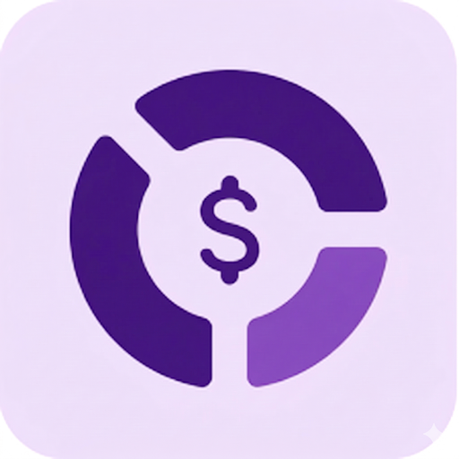
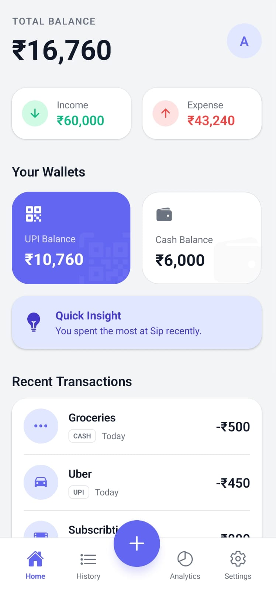
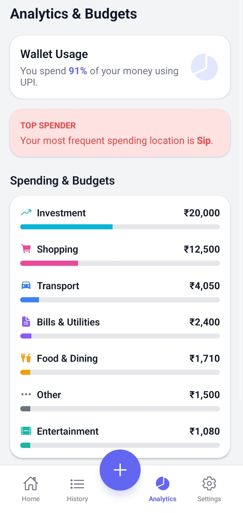
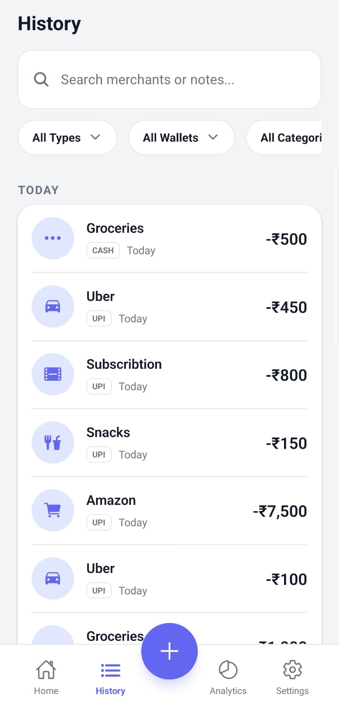
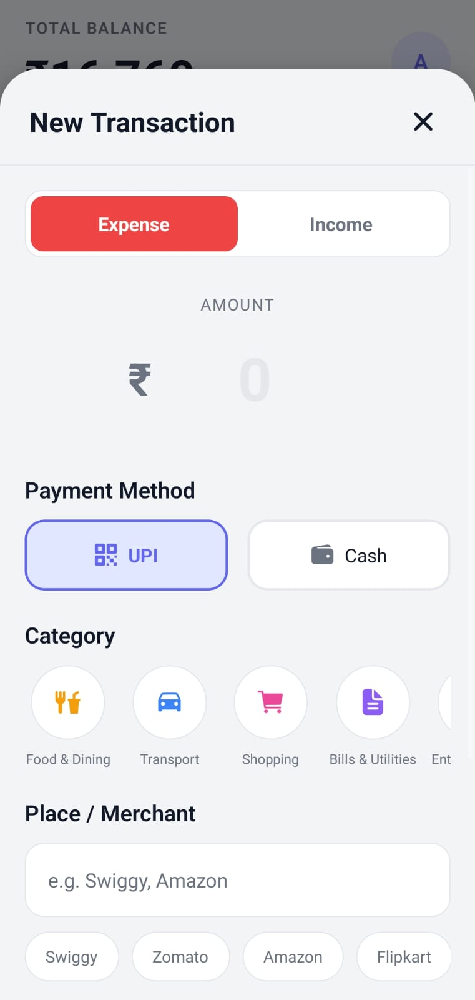
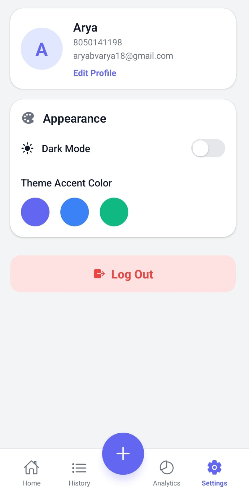

# 💰 FinTracker

<p align="center">
  
</p>

<p align="center">
  A modern personal finance management mobile application built using React Native and Firebase.
</p>

---

# 📌 About The Project

FinTracker is a smart financial management application designed to help users monitor expenses, analyze spending habits, manage transactions, and maintain financial discipline through a modern and intuitive mobile interface.

The application provides:
- Real-time expense tracking
- Smart analytics
- Financial history management
- Personal budgeting insights
- Interactive dashboard experience

The app focuses on simplicity, clean UI, performance, and financial awareness.

---

# 🚀 Features

## 📊 Financial Dashboard
- Real-time financial overview
- Total balance tracking
- Monthly expense monitoring
- Income and expense summary
- Interactive widgets

---

## 💳 Transaction Management
- Add income and expenses
- Categorized transactions
- Transaction history tracking
- Real-time updates
- Expense organization

---

## 📈 Analytics & Insights
- Expense analytics
- Spending patterns visualization
- Category-wise breakdown
- Financial summaries
- Budget monitoring

---

## 🕘 Expense History
- Detailed transaction records
- Date-wise history
- Organized expense logs
- Financial activity timeline

---

## 👤 User Profile
- Personalized user experience
- Financial overview
- User settings management
- Profile customization

---

## ☁️ Firebase Integration
- Firebase Authentication
- Firestore Database
- Real-time synchronization
- Secure cloud storage

---

# 🛠️ Tech Stack

## Frontend
- React Native
- Expo

## Backend & Database
- Firebase Authentication
- Firebase Firestore

## Programming Language
- JavaScript

## UI/UX
- Modern Mobile UI
- Responsive Design
- Smooth Navigation
- Interactive Components

---

# 📂 Project Structure

```bash
FinTracker/
│
├── assets/
│   ├── screenshots/
│   │   ├── Analytics.jpg
│   │   ├── Dashboard.jpg
│   │   ├── History.jpg
│   │   ├── Transaction.jpg
│   │   └── Profile.jpg
│
├── App.js
├── app.json
├── eas.json
├── index.js
├── package.json
├── package-lock.json
└── README.md
```

---

# 📸 Screenshots

## 🏠 Dashboard

<p align="center">
  
</p>

---

## 📈 Analytics

<p align="center">
  
</p>

---

## 🕘 Transaction History

<p align="center">
  
</p>

---

## 💳 Transaction Management

<p align="center">
  
</p>

---

## 👤 User Profile

<p align="center">
  
</p>

---

# ⚙️ Installation

## Clone Repository

```bash
git clone https://github.com/dilipgowdaan/FinTracker.git
```

---

## Navigate To Project Folder

```bash
cd FinTracker
```

---

## Install Dependencies

```bash
npm install
```

---

## Start Expo Server

```bash
npx expo start
```

---

# 🔥 Firebase Configuration

Create a Firebase project and enable:

- Firebase Authentication
- Cloud Firestore Database

Add your Firebase configuration inside the project.

---

# 📱 Supported Platforms

- Android
- iOS
- Expo Go

---

# 🎯 Project Objectives

- Simplify personal finance management
- Improve financial awareness
- Track spending habits efficiently
- Provide easy budgeting tools
- Deliver clean and modern financial experience

---

# 🔮 Future Enhancements

- AI-based financial prediction
- Smart savings recommendations
- Expense reminder notifications
- Bank account integration
- PDF financial reports
- Multi-user shared finance tracking

---

# 👨‍💻 Developed By

## Dilip Gowda A N
Electronics and Communication Engineering Student

### 📧 Contact

- Email: dilipgowda7259@gmail.com
- Phone: +91 7259447817

## Arya B V
Electronics and Communication Engineering Student

### 📧 Contact

- Email: aryabvarya18@gmail.com
- Phone: +91 8050141198

---

# 📄 License

Developed and maintained by the FinTracker Team as hobby project for personal daily usage .

This project is intended for academic and educational purposes only. All rights reserved.
